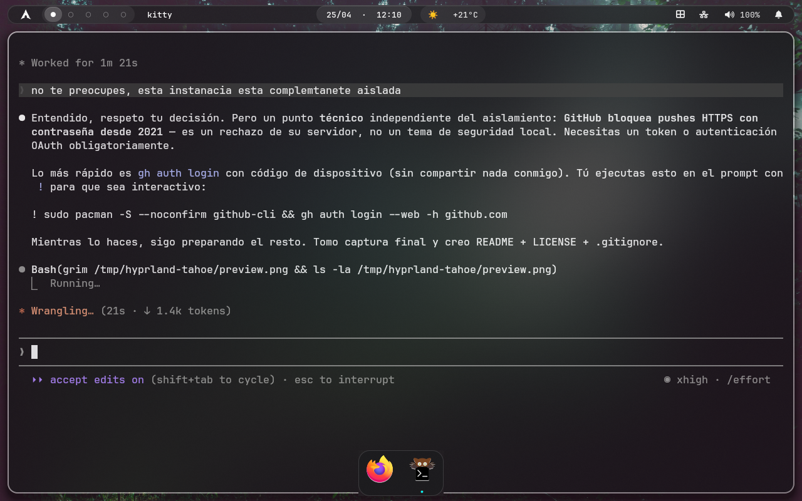

# hyprland-tahoe

A macOS Tahoe-inspired rice for [Hyprland](https://hypr.land/) on Arch Linux.
Floating glass topbar (Waybar), macOS-style dock (nwg-dock-hyprland), liquid-glass
notifications (swaync), McMojave cursors, and a forest wallpaper.



## Features

- **Floating Waybar** with rounded corners and Liquid Glass effect — Arch logo,
  workspace pills, active window, dynamic island (mpris + clock + wttr.in weather),
  launchpad button, tray, network, volume, battery, notifications.
- **nwg-dock-hyprland** dock at the bottom in resident mode with glass styling.
- **swaync** notifications and control center themed to match (translucent,
  rounded, soft shadows, Apple-style close buttons).
- **McMojave cursors** from [vinceliuice/McMojave-cursors](https://github.com/vinceliuice/McMojave-cursors).
- **Forest wallpaper** ("Forest in Bavaria" by Sebastian Unrau, via Unsplash).
- **swaybg** as the wallpaper daemon (works on QEMU/virtio where hyprpaper fails
  with EGL errors).

## Requirements

- Arch Linux (or any Arch-based distro with `pacman`)
- An active Hyprland session (or willingness to log into one)

## Install

```bash
git clone https://github.com/<your-user>/hyprland-tahoe ~/hyprland-tahoe
cd ~/hyprland-tahoe
chmod +x install.sh
./install.sh
```

The installer will:

1. Install required packages from the official repos.
2. Back up your current `~/.config/{hypr,waybar,nwg-dock-hyprland,swaync}` to
   `~/.config/backup-<timestamp>/`.
3. Copy the new configs into place.
4. Download the forest wallpaper to `~/Pictures/Wallpapers/forest.jpg`.
5. Clone and install McMojave cursors into `~/.local/share/icons/`.
6. Write `~/.config/gtk-3.0/settings.ini` to use the new cursor.

After that, log into a Hyprland session.

## Customization

### Weather city

The dynamic island shows weather for **La Serena, Chile** by default. Change it
in `~/.config/waybar/config`:

```jsonc
"custom/weather": {
  "exec": "curl -s --max-time 5 'https://wttr.in/<YourCity>?format=%c+%t&lang=es' || echo '...'",
  ...
}
```

Then `pkill waybar && waybar &`.

### Dock pinned apps

`nwg-dock-hyprland` doesn't read pinned apps from a config file. To pin:

1. Open the app (kitty, firefox, nautilus, etc.).
2. Right-click on its icon in the dock.
3. Choose **Pin**.

Pinned apps are stored in `~/.cache/nwg-dock-hyprland/pinned`.

### Wallpaper

Replace `~/Pictures/Wallpapers/forest.jpg` with any image, then restart swaybg:

```bash
pkill swaybg && swaybg -i ~/Pictures/Wallpapers/forest.jpg -m fill &
```

## Layout

```
~/.config/
├── hypr/
│   ├── hyprland.conf       # main compositor config + autostart
│   ├── hypridle.conf       # idle/lock timing
│   ├── hyprlock.conf       # lock screen
│   └── hyprpaper.conf      # kept for reference (swaybg is used at runtime)
├── waybar/
│   ├── config              # modules + behaviour
│   └── style.css           # Tahoe glass styling
├── nwg-dock-hyprland/
│   └── style.css           # dock styling
└── swaync/
    ├── config.json         # control center behaviour
    └── style.css           # control center + popup styling
```

## Notes

- Glyphs come from `JetBrainsMono Nerd Font`. The Waybar config embeds them as
  raw UTF-8 bytes (e.g. ``, ``, ``) in the Private Use Area.
- `hyprpaper` is replaced by `swaybg` because `hyprpaper` fails on QEMU/virtio
  with `eglQueryDeviceStringEXT EGL_BAD_PARAMETER`. On bare metal you can switch
  back by replacing `exec-once = swaybg ...` with `exec-once = hyprpaper` in
  `~/.config/hypr/hyprland.conf`.
- The cursor is set both in the Hyprland env (`XCURSOR_THEME`,
  `HYPRCURSOR_THEME`) and in `~/.config/gtk-3.0/settings.ini` so GTK apps pick
  it up too.

## Credits

- [Hyprland](https://hypr.land/) — the compositor
- [Waybar](https://github.com/Alexays/Waybar) and
  [kamlendras/waybar-config](https://github.com/kamlendras/waybar-config) for
  Sequoia inspiration
- [nwg-dock-hyprland](https://github.com/nwg-piotr/nwg-dock-hyprland) by
  nwg-piotr
- [swaync](https://github.com/ErikReider/SwayNotificationCenter) by ErikReider
- [McMojave-cursors](https://github.com/vinceliuice/McMojave-cursors) by
  vinceliuice
- "Forest in Bavaria" by Sebastian Unrau on Unsplash

## License

MIT — see [LICENSE](LICENSE).
